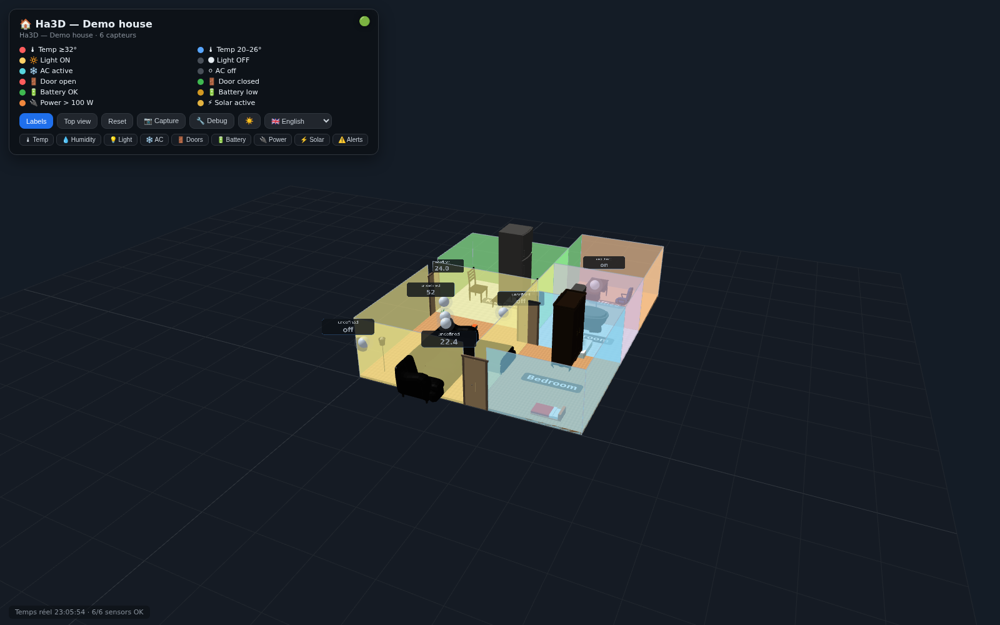

# 🏠 Maison 3D — Visualiseur 3D des capteurs Home Assistant

Visualiseur 3D interactif (three.js) de votre maison avec les capteurs Home Assistant en temps réel : températures, clims, lumières cliquables, portes animées, solaire, batteries. Éditeur intégré : dessinez vos pièces, placez portes et meubles, ajoutez vos entités — le tout sauvegardé dans un fichier JSON local.

> **🌍 Langues** — [🇫🇷 Français](README.fr.md) · [🇬🇧 English](README.md)



*Maison de démonstration avec capteurs simulés — aucun Home Assistant requis pour essayer.*

## ✨ Fonctionnalités

- **Rendu 3D** de la maison (vue isométrique par défaut, OrbitControls : orbite / zoom / pan)
- **Capteurs en direct** depuis Home Assistant (WebSocket HA → SSE temps réel, fallback 60 s)
- **Icônes 3D par type** : thermomètre (temp), goutte (humidité), flocon (clim), ampoule (lumière), éclair (conso), batterie, panneau solaire, porte, alerte
- **Lumières 3D cliquables** : toggle via l'API HA (halo + ombres portées)
- **Portes réelles animées** : murs découpés aux ouvertures, cadres + vantaux pivotants selon l'état HA (on = ouverte, transition douce)
- **Murs fusionnés** : murs partagés entre pièces dédupliqués (pas de clipping)
- **Jour/nuit saisonnier 🌗** : position du soleil calculée selon date/heure réelles et géolocalisation (lever/coucher naturels, lumière et couleurs adaptées), modes manuels ☀️/🌙
- **Étiquettes anti-chevauchement**
- **Mode debug 🔧** :
  - Drag & drop des entités (sol X/Z ou hauteur Y)
  - Édition des pièces 🏠 (déplacer, redimensionner, polygones), portes 🚪 et objets 🛋️ (drag, rotation molette ou touche **R**, ➕ ajouter, 🗑️ supprimer)
  - **Undo/Redo : Ctrl+Z / Ctrl+Shift+Z** (50 étapes)
  - Ajout / suppression d'entités HA (recherche en direct)
  - Vues caméra enregistrées 🎥, capture de la caméra par défaut
  - Sauvegarde directe sur le serveur (backup automatique)
- **Historique 24 h** par capteur (courbe)
- **Alertes** : porte ouverte, batterie faible, température élevée
- **Filtres** par type, **Capture PNG** du rendu

## 🚀 Installation

```bash
git clone https://github.com/v3ry/ha3d.git
cd ha3d

# 1. Configuration : URL + token Home Assistant
cp .env.example .env
#    éditez .env : HASS_URL=http://<ip-ha>:8123 et HA_TOKEN=<jeton longue durée>
#    (Profil Home Assistant > Jetons d'accès longue durée)

# 2. Layout de départ (maison de démonstration)
cp layout.example.json layout.json

# 3. Lancement
python3 ha3d_server.py
# → http://127.0.0.1:9125
```

> **Note** : sans `layout.json`, le serveur démarre avec une maison de démonstration — utilisez le mode debug 🔧 pour dessiner vos pièces et ajouter vos entités.

### Accès depuis d'autres appareils

```bash
# Dans .env : exposer sur le réseau local
MAISON3D_HOST=0.0.0.0
```

### Systemd (auto-démarrage)

```bash
cp maison3d.service.example ~/.config/systemd/user/maison3d.service
# adaptez WorkingDirectory/ExecStart à votre chemin d'installation
systemctl --user daemon-reload
systemctl --user enable --now maison3d
```

### Docker

```bash
cp .env.example .env    # remplir HASS_URL + HA_TOKEN
cp layout.example.json layout.json   # ou laisser la démo auto-générée

# Build + lancement
docker compose up -d --build
# → http://127.0.0.1:9125
```

Le conteneur tourne en **utilisateur non-root**, monte `layout.json` et `ha3d_layout_backups/` en volumes (persistance + backups). Le serveur écrit les backups dans `HA3D_BACKUP_DIR` (défaut : `~/ha3d_layout_backups`, surchargeable).

### Vérifier la configuration

```bash
python3 tools/check_config.py   # .env, connexion HA, validité du layout
```

## ⚙️ Configuration

- **`.env`** : `HASS_URL`, `HA_TOKEN` (obligatoires) ; `MAISON3D_HOST` (défaut `127.0.0.1`), `MAISON3D_PORT` (défaut `9125`) ; `HA3D_LAT`/`HA3D_LON` (optionnels — par défaut auto-détectés depuis la config HA) ; `HA3D_BACKUP_DIR` (répertoire des backups, défaut `~/ha3d_layout_backups`)
- **`layout.json`** : pièces, entités, positions, caméra — généré via l'éditeur 3D (mode debug), sauvegardé avec backup automatique dans `~/ha3d_layout_backups/`

## 🌍 Langues

L'interface est disponible en **10 langues** : 🇫🇷 Français · 🇬🇧 English · 🇩🇪 Deutsch · 🇪🇸 Español · 🇮🇹 Italiano · 🇵🇹 Português · 🇳🇱 Nederlands · 🇵🇱 Polski · 🇹🇷 Türkçe · 🇷🇺 Русский.

La langue est détectée automatiquement depuis votre navigateur (`navigator.language`) et peut être changée à tout moment avec le **sélecteur en haut à gauche** (HUD). Votre choix est mémorisé (`localStorage`).

## 🛡️ Sécurité

- **Le serveur écoute sur `127.0.0.1` par défaut** — exposez-le (`MAISON3D_HOST=0.0.0.0`) uniquement sur un réseau de confiance
- Les endpoints d'écriture (`/api/save-layout`, `/api/toggle`) **ne sont pas authentifiés** : ne publiez jamais ce serveur sur Internet
- Vos données restent locales : `layout.json` (pièces, entités, position GPS) est ignoré par git
- Le token HA n'est lu que depuis `.env` (jamais committé)

## 🧰 Développement

```bash
python3 -m unittest test_ha3d_server   # tests serveur + validation layout
```

## 🗂️ Architecture

| Fichier | Rôle |
|---|---|
| `ha3d_server.py` | Serveur HTTP + proxy API HA (layout, status, history, toggle, save-layout, entités, SSE) |
| `index.html` | Client three.js (rendu, interactions, mode debug) — aucune dépendance npm |
| `layout.json` | Configuration locale (pièces, entités, positions, caméra) — **non versionné** |
| `layout.example.json` | Layout de démonstration |
| `models/` | Modèles glTF 3D (CC0 — poly.pizza + Khronos), servis par `/models/*.glb` |
| `ha_ws.py` | Client websocket HA (pilotage dashboards Lovelace) |
| `tools/` | Utilitaires : `check_config.py` (vérif pré-lancement), `fetch_furniture.py` (catalogue CC0) |
| `Dockerfile`, `docker-compose.yml` | Conteneur (utilisateur non-root, volumes layout + backups) |

## 📦 Catalogue de modèles 3D

Le panneau objet permet de choisir le type : **🟫 Boîte simple** ou **🧊 modèle 3D** (liste chargée depuis `/api/models`). Déposez un `.glb` dans `models/` — il apparaît automatiquement dans la liste.

28 modèles inclus, tous **CC0** : canapés, tables, lits, chaises, armoires, rangements, électroménager, salle de bain, lampes, plante (source [poly.pizza](https://poly.pizza) + Khronos Sample Models) — voir `models/README.md` pour l'attribution détaillée.

## 📄 Licence

[MIT](LICENSE) © 2026 v3ry — usage libre, y compris commercial.
